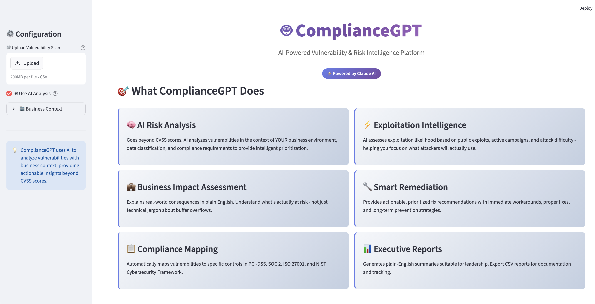
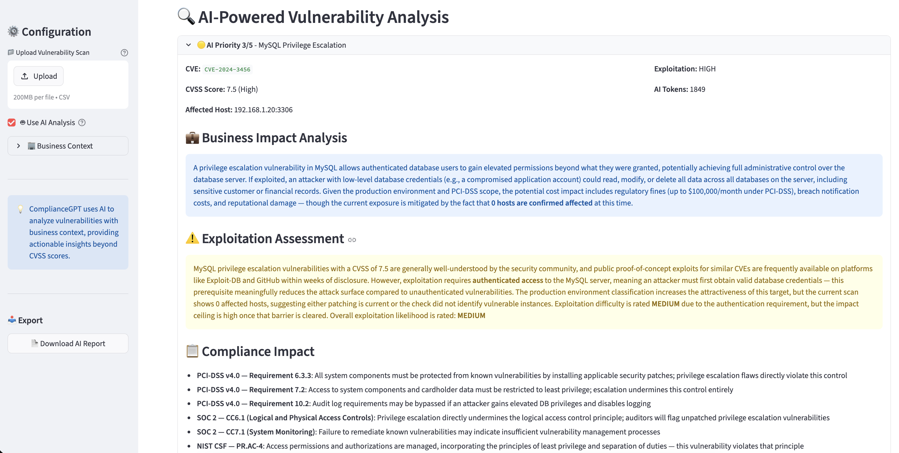

# 🤖 ComplianceGPT

**AI-Powered Vulnerability & Risk Intelligence Platform**

ComplianceGPT uses Claude AI to analyze vulnerability scans with business context, providing intelligent prioritization, business impact assessment, compliance mapping, and actionable remediation guidance.



---

## Features

### AI-Powered Risk Analysis
- Context-aware vulnerability prioritization beyond CVSS scores
- Analyzes vulnerabilities in context of YOUR business environment
- Considers data classification, environment type, and compliance requirements

### Business Impact Assessment
- Plain-English explanations of real-world consequences
- Quantifies potential business impact
- Bridges gap between technical findings and business risk

### Exploitation Intelligence
- Assesses exploitation likelihood based on active threats
- Identifies public exploits and active campaigns
- Evaluates attack difficulty and attacker motivation

### Compliance Intelligence
- Automatic mapping to compliance frameworks:
  - PCI-DSS (Payment Card Industry Data Security Standard)
  - SOC 2 (Service Organization Control)
  - ISO 27001 (Information Security Management)
  - NIST Cybersecurity Framework
- Identifies specific control failures
- Generates audit-ready documentation

### Smart Remediation
- Prioritized, actionable fix recommendations
- Immediate workarounds for critical issues
- Short-term and long-term prevention strategies
- Estimated effort and complexity

### Executive Reporting
- Plain-English summaries for leadership
- CSV export for tracking and documentation
- Visual dashboards with priority metrics

---

## Quick Start

### Prerequisites
- Python 3.8+
- Anthropic API key ([Get one here](https://console.anthropic.com/))
- macOS, Linux, or Windows

### Installation

```bash
# Clone the repository
git clone https://github.com/Itstwisha/compliancegpt.git
cd compliancegpt

# Create virtual environment
python3 -m venv venv
source venv/bin/activate  # On Windows: venv\Scripts\activate

# Install dependencies
pip install -r requirements.txt

# Configure environment
cp .env.example .env
# Edit .env and add your Anthropic API key
```

### Configuration

Edit `.env` file:
```bash
ANTHROPIC_API_KEY=your_api_key_here
AI_MODEL=claude-sonnet-4-6
AI_MAX_TOKENS=4000
AI_TEMPERATURE=0.3
```

### Usage

#### Run the Dashboard
```bash
streamlit run dashboard.py
```

Opens at `http://localhost:8501`

#### Try with Sample Data
1. Click "Try with Sample Data" button
2. AI analyzes 5 sample vulnerabilities (~30 seconds)
3. View detailed AI analysis for each vulnerability
4. Export results as CSV

#### Analyze Your Own Scans
1. Upload vulnerability scan CSV (Nessus, OpenVAS, or custom format)
2. Configure business context (environment, data classification, compliance)
3. Wait for AI analysis (1-2 minutes for typical scans)
4. Review findings and export report

---

## Supported Scan Formats

### Nessus CSV Export
Export from Nessus with these columns:
- `plugin_id`, `cve_id`, `cvss_score`, `severity`
- `name`, `description`, `solution`
- `host`, `port`, `protocol`

### OpenVAS CSV/XML
Standard OpenVAS export formats supported

### Custom CSV
Any CSV with the required columns above

---

## Architecture
compliancegpt/
│
├── src/
│   ├── ai/                          # AI integration layer
│   │   └── claude_client.py         # Anthropic Claude API client
│   │
│   ├── analyzers/                   # Analysis engines
│   │   └── vulnerability_analyzer.py
│   │
│   ├── integrations/                # Data parsers
│   │   └── csv_parser.py            # CSV vulnerability parser
│   │
│   └── core/                        # Core utilities
│
├── data/
│   ├── sample_vulnerabilities.csv   # Demo data
│   └── uploads/                     # User uploads directory
│
├── dashboard.py                     # Streamlit web interface
├── config.yaml                      # Application configuration
├── requirements.txt                 # Python dependencies
├── .env.example                     # Environment template
└── README.md                        # This file

---

## How It Works

### 1. Data Ingestion
Parses vulnerability scans from CSV files (Nessus, OpenVAS, custom)

### 2. Context Enrichment
Adds business context:
- Environment type (Production, Staging, etc.)
- Data classification (PII, Payment Data, etc.)
- Compliance requirements (PCI-DSS, SOC 2, etc.)

### 3. AI Analysis
Claude AI analyzes each vulnerability:
```python
For each vulnerability:
  - Assess business impact in plain English
  - Evaluate exploitation likelihood
  - Map to compliance frameworks
  - Generate prioritization (1-5 scale)
  - Create remediation roadmap
```

### 4. Intelligent Prioritization
AI-assigned priority (1-5) based on:
- CVSS score (30%)
- Exploitability (25%)
- Business impact (25%)
- Compliance impact (20%)

### 5. Actionable Output
- Interactive dashboard with findings
- Detailed AI analysis per vulnerability
- Exportable CSV reports

---

## Sample Output


🔴 CRITICAL Priority 5/5 - Apache HTTP Server RCE
CVE: CVE-2024-1234
CVSS: 9.8 (Critical)
Host: 192.168.1.10:443
Business Impact Analysis:
"A successful exploitation of this Remote Code Execution vulnerability
would grant attackers complete control over your production web servers.
In your payment processing environment, this could lead to:

Theft of customer payment data (PCI-DSS violation)
Regulatory fines ($100K-$500K range)
Reputational damage and customer trust loss
Estimated breach cost: $500K-$2M based on similar incidents."

⚠️ Exploitation Assessment:
"VERY HIGH - Public exploit code is available. Active exploitation
observed in the wild. Attack requires no authentication and is
trivial to execute. Expect automated scanning and exploitation
attempts within hours of vulnerability disclosure."

Compliance Impact:
Violates PCI-DSS Requirement 6.2 (timely security patches)
SOC 2 CC6.1 control failure (system security)
ISO 27001 A.12.6.1 non-compliance (vulnerability management)

Remediation Plan:
Immediate (within 24 hours):

Apply WAF rule to block known exploit patterns
Segment affected servers from payment processing network

Short-term (within 1 week):

Upgrade Apache to version 2.4.58
Validate patch effectiveness
Document remediation in compliance records

Long-term:

Implement automated patch management
Add vulnerability scanning to CI/CD pipeline
Establish 48-hour patch SLA for critical vulnerabilities


---

## Use Cases

### For Security Teams
- Automate vulnerability triage
- Focus on high-impact threats
- Generate executive summaries
- Track remediation progress

### For GRC Teams
- Map vulnerabilities to compliance controls
- Generate audit-ready documentation
- Demonstrate control effectiveness
- Support risk assessment processes

### For IT Teams
- Prioritize patching efforts
- Understand business context of vulnerabilities
- Get clear remediation guidance
- Coordinate fixes across teams

---

## Roadmap

- [ ] OpenVAS XML parser
- [ ] Nessus API integration
- [ ] Historical trend analysis
- [ ] Email/Slack alerting
- [ ] Automated remediation tracking
- [ ] Executive PDF reports
- [ ] API for CI/CD integration
- [ ] Support for additional compliance frameworks (HIPAA, GDPR)

---

## Contributing

Contributions welcome! Please:
1. Fork the repository
2. Create a feature branch
3. Make your changes
4. Submit a pull request

---

## License

MIT License - see LICENSE file

---

## Author

**Twisha Sharma**
- GitHub: [@Itstwisha](https://github.com/Itstwisha)
- LinkedIn: [twisha-sharma](https://linkedin.com/in/twisha-sharma)

---

## Acknowledgments

- Anthropic Claude AI for intelligent analysis
- CIS Benchmarks for security standards
- NIST, PCI SSC, ISO for compliance frameworks

---

## Support

Issues? Please [open an issue](https://github.com/Itstwisha/compliancegpt/issues)


---
